# 📚 11th Lesson – From Static Website to Full LMS Ecosystem 🚀


> **Learn Faster. Learn Smarter.**  
A complete **Learning Management System (LMS)** evolved from a simple static website into a **full-stack, cross-platform mobile learning experience**.


---


## 🌟 Project Story (Evolution Journey)


This project was not built in a single step — it evolved through multiple stages, improving scalability, usability, and real-world application.


### 🧱 Phase 1 – Static Website  
🔗 https://github.com/refat-pasha/11th-Lesson  
- Basic frontend LMS concept  
- Static pages for study materials  
- No backend or dynamic features  


---


### 🧠 Phase 2 – Flask + SQLAlchemy Backend  
🔗 https://github.com/refat-pasha/11th-lesson_SQLAlchemy_userAuth_quiz_table  
- Advanced backend using Flask  
- Structured database with SQLAlchemy  
- Quiz system with database models  
- Improved scalability and architecture  


---


### ⚙️ Phase 3 – PHP + MySQL Backend  
🔗 https://github.com/refat-pasha/11th-lesson-with-php-backend-and-mysql  
- Implemented user authentication  
- Dynamic content handling  
- MySQL database integration  
- Initial LMS functionality  


---


### 📱 Phase 4 – Flutter Mobile App (Current)
- Fully functional cross-platform LMS  
- Built with Flutter + Firebase + GetX  
- Real-time, interactive, and user-friendly  


---


## 🎯 What Makes 11th Lesson Different?


- ⚡ Fast learning & last-minute preparation  
- 🎮 Gamification (XP, streaks, progress tracking)  
- 🎨 Customizable user experience  
- 🤝 Interactive learning (quizzes, groups, discussions)  
- 📱 Mobile-first design  


---


## 👥 Target Users


- 🎓 University students  
- 🧑‍🏫 Teachers & instructors  
- 📘 Self-learners  
- 🏫 Schools and institutions  


---


## 📸 Screenshots


## 📸 Screenshots

### 🔐 Authentication & Onboarding
<p align="center">
  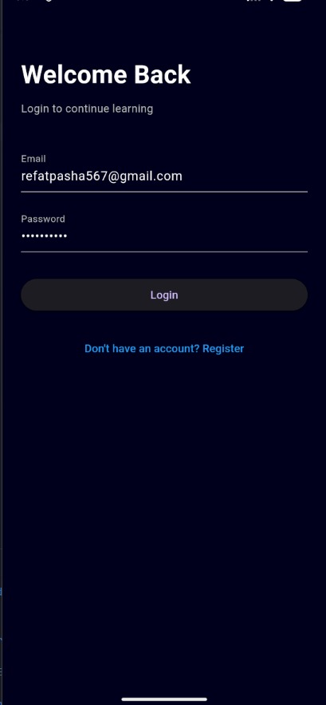
  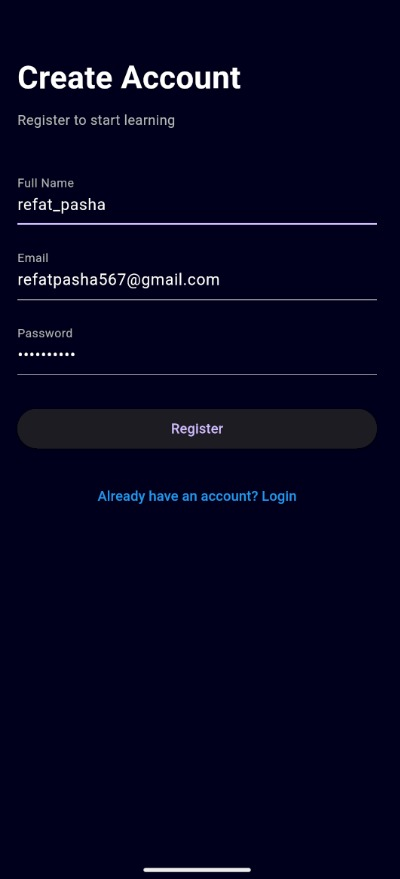
  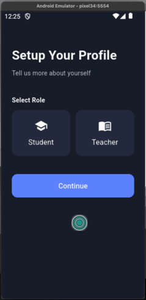
  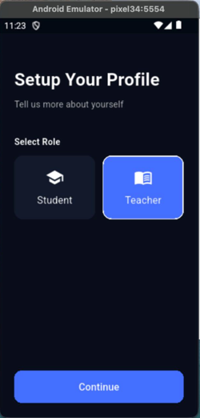
  
</p>

---

### 🏠 Dashboard & Learning Experience
<p align="center">
  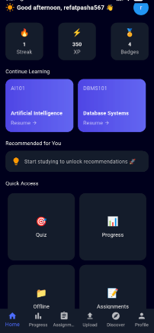
  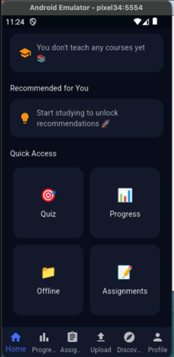
  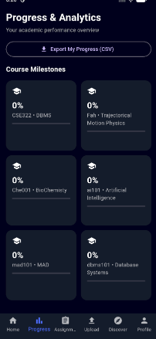
  
</p>

---

### 🧠 Quiz System
<p align="center">
  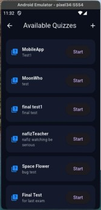
  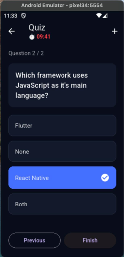
  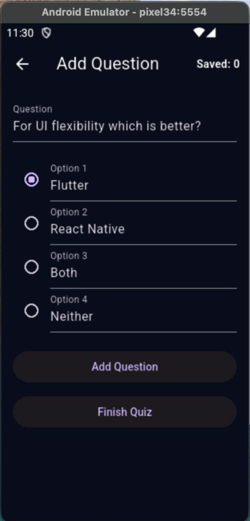
  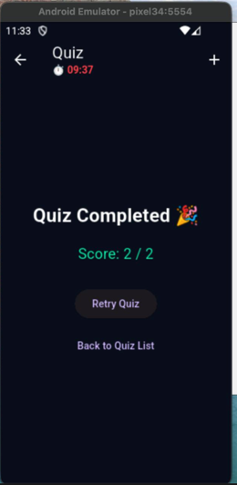
  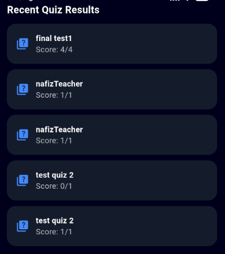
</p>

---

### 📂 Assignments & Content Upload
<p align="center">
  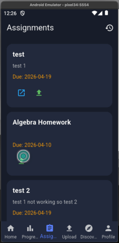
  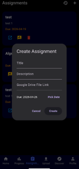
  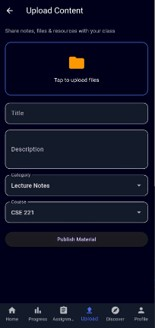
  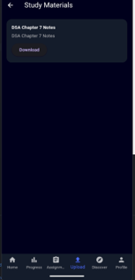
</p>

---

### 👥 Study Groups & Collaboration
<p align="center">
  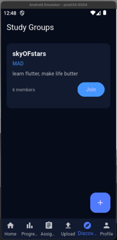
  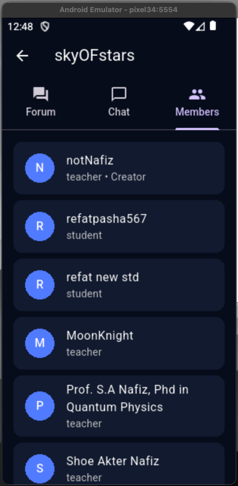
</p>

---

### 📚 Offline Learning
<p align="center">
  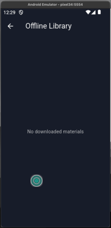
</p>

---

### 👤 Profile & Settings
<p align="center">
  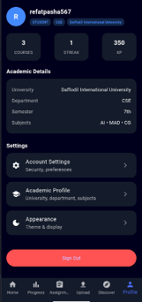
  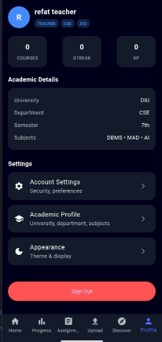
</p>


---


## 🚀 Core Features


### 🎓 Student Features
- Access courses and study materials  
- Attempt quizzes with instant results  
- Track progress, XP, and streaks  
- Offline material access  
- Join study groups  


---


### 🧑‍🏫 Teacher Features
- Upload notes and resources  
- Create assignments and quizzes  
- Manage course content  
- Interact with students  


---


### ⚙️ General Features
- Firebase Authentication  
- Cloud Firestore Database  
- Firebase Storage  
- Dark Mode UI  
- Local storage (GetStorage)  
- File upload system  


---


## 🏗️ Tech Stack


### 📱 Mobile App
- Flutter  
- GetX (State Management, Routing, Dependency Injection)


### 🔥 Backend (Mobile)
- Firebase (Auth, Firestore, Storage)


### 🌐 Previous Backend
- PHP + MySQL  
- Flask + SQLAlchemy  


---


## 🧩 Architecture Overview
Flutter UI

↓

GetX (State Management)

↓

Controllers

↓

Repositories

↓

Firebase Services

(Auth | Firestore | Storage)


---


## ⚡ Getting Started


### Prerequisites
- Flutter SDK (>= 3.3.0)
- Firebase Project Setup
- Android Studio / VS Code


---


### Installation


```bash
# Clone repository
git clone https://github.com/refat-pasha/11th-Lesson


# Navigate to project
cd eleventh_lesson


# Install dependencies
flutter pub get


# Run the app
flutter run

📦 Dependencies

get (state management)


firebase_core


firebase_auth


cloud_firestore


firebase_storage


get_storage


file_picker


🧠 Key Learning Outcomes

Built a full LMS from scratch


Worked with multiple backend technologies


Designed scalable architecture


Implemented real-world features (auth, storage, analytics)


Developed a production-ready mobile app


🚧 Future Improvements

Play Store deployment


Push notifications


Real-time chat system


AI-based recommendations


Advanced analytics


👨‍💻 My Contribution

Built complete backend and database (web versions)


Developed full Flutter mobile application


Implemented GetX architecture


Designed UI/UX


🤝 Team Contribution
This project was developed as a team effort involving:

Frontend development


Backend engineering


UI/UX design


⭐ Support
If you find this project useful, consider giving it a ⭐ on GitHub!


